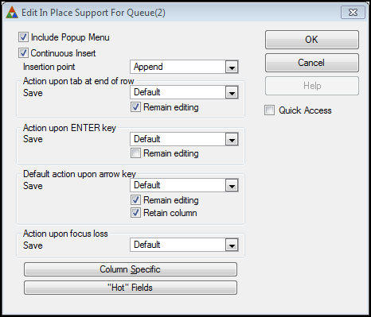
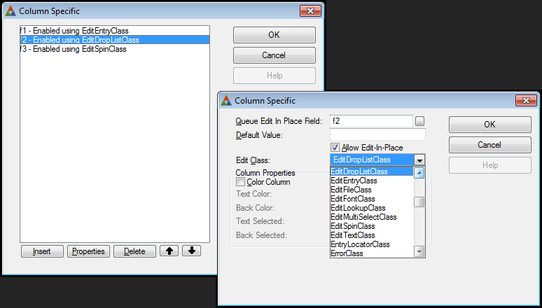
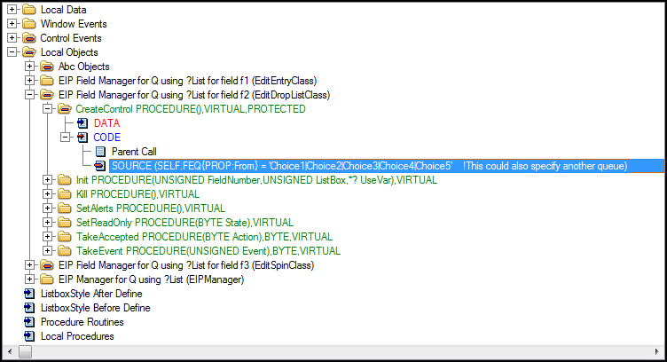
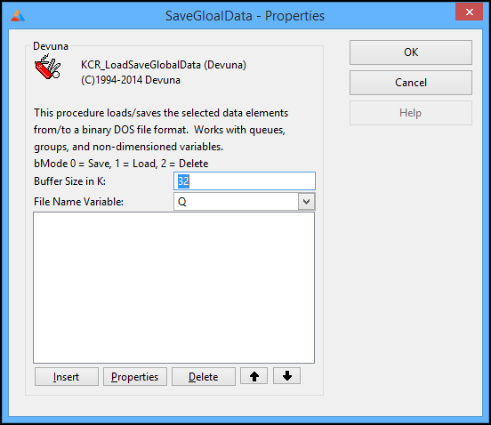

# Queue Edit-in-Place #

### Queue Edit-in-Place Templates are written in and for Clarion for Windows ###

## License ##
Distributed under the [MIT License](https://opensource.org/licenses/MIT).

## Overview ##

There are two templates included in the Queue Edit in Place Template set:

1. KCR_QueueEIP - CONTROL template that provides 'Edit-In-Place' support for a QUEUE
2. KCR_LoadSaveGlobalData - PROCEDURE template to Load/Save Global data from/to a binary file  

### KCR_QueueEIP ###

On a screen where you would normally populate a browse control, populate the KCR_QueueEIP control instead.

The prompts for this control are virtually the same as a normal browse control.

### Screen Shots ###

##### [main property page] #####



##### [after pressing Column Specific button] #####



#### [as viewed in the embed tree] ####



### KCR_LoadSaveGlobalData ###

The second template is a procedure template that lets you save/load global data
to/from a binary dos image.  This is provided so you can save/or load queue data.

**CAUTION**``` If you change the structure of any of the data that you have previously
saved with the template, you will not be able to load the saved data (in fact you 
will likely cause your program to gpf).  So, make sure the structure of the data
you intend to save/load is in its final format before using this template.

### Screen Shots ###




### Example Application ###
The example application is normally installed in 

> CSIDL\_COMMON_DOCUMENTS\SoftVelocity\Clarion10\Accessory\Devuna\Examples\Queue Edit-In-Place

## Release Notes ##
1. 02/02/2017  -   Validated for Clarion 10.0.12463
2. 03/05/2015  -   Validated for Clarion 10.0
3. 05/22/2014  -   Validated for Clarion 9.1.
4. 07/27/2013  -   Validated for Clarion 9.0.10247
5. 04/24/2011  -   Validated for Clarion 7.3.8222
6. 06/04/2005  -   Validated for Clarion 6.2.9045
7. 08/28/2003  -   Added more embeds to make coding easier.  c6.0 release
8. 04/29/2001  -   Kill routine modified to avoid memory leak
9. 04/16/2001  -   Modified to be compatible with C55 patch 'c'
10. 03/03/2001  -   Removed icons from buttons, Removed absolute control placement attributes, Placed all template prompts on separate sheet
